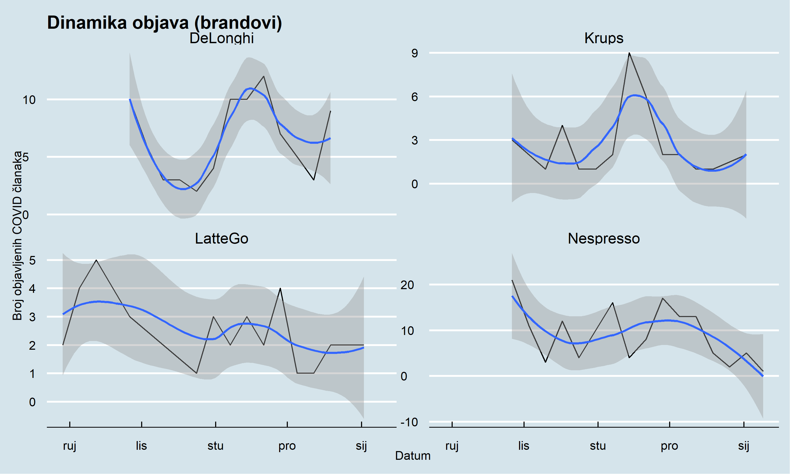
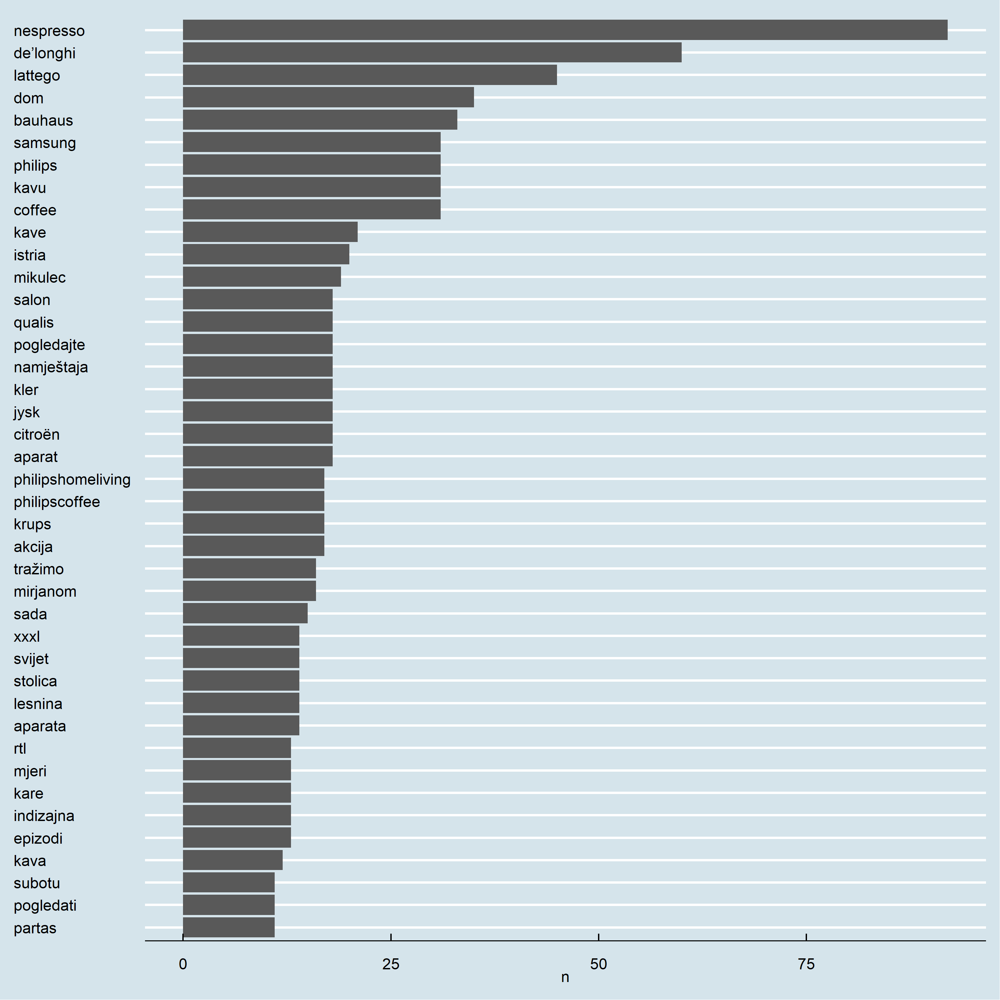
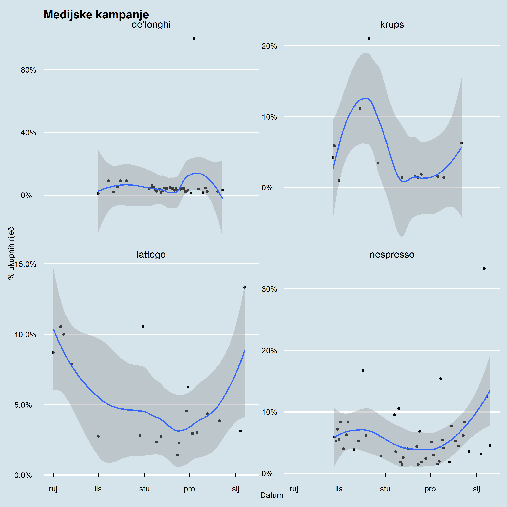

### Što je unutra?


- Medijske objave o aparatima za kavu u Hrvatskoj (*LatteGo*, *De`Longhi*, *Krups* i *Nesspreso*)
<br><br>
- Cijeli medijski prostor u Hrvatskoj 
<br><br>
- razdoblje od 2021-01-09 do 2022-11-01
<br><br>
- Podatci sa [mediatoolkit servisa](https://www.mediatoolkit.com/) 
<br><br>
- 290 objava koje sadrže ukupno 8.980 riječi
<br><br>
- Izvještaj uključuje: **dekriptivni pregled medijskog prostora**, **analizu sentimenta**, **analizu frekvencija** i **tematsku analizu**.


Medijski prostor:

<br>
<button class="btn btn-primary" data-toggle="collapse" data-target="#Block6"> Pregled medijskog prostora </button>  
<div id="Block6" class="collapse">

<!-- --><!-- --><!-- --><!-- -->

</div>
<br>


<br>

<button class="btn btn-primary" data-toggle="collapse" data-target="#Block7"> Najčešće riječi u tekstu </button>  
<div id="Block7" class="collapse">

<!-- --><!-- -->

</div>
<br>


Ovako izgleda WordCloud koji sadržava i prikaz sentimenta:

<button class="btn btn-primary" data-toggle="collapse" data-target="#Block8"> Najčešće riječi u tekstu </button>  
<div id="Block8" class="collapse">

<!-- -->

</div>
<br>


## Analiza sentimenta


Provjerimo kretanje sentimenta u vremenu:


<br>
<button class="btn btn-primary" data-toggle="collapse" data-target="#Block9"> Kretanje sentimenta kroz vrijeme </button>  
<div id="Block9" class="collapse">

<!-- -->

</div>
<br>


Korisno je i promotriti koje riječi najviše doprinose sentimentu (pozitivnom, negativnom i neutralnom):

<br>
<button class="btn btn-primary" data-toggle="collapse" data-target="#Block10"> Doprinos sentimentu </button>  
<div id="Block10" class="collapse">

<!-- -->

</div>
<br>


Analiza sentimenta se može iskoristiti za pregled pozitivnosti pojedinih brandova:


<br>
<button class="btn btn-primary" data-toggle="collapse" data-target="#Block12"> Indeks pozitivnosti brandova </button>  
<div id="Block12" class="collapse">

<table>
 <thead>
  <tr>
   <th style="text-align:left;"> kword </th>
   <th style="text-align:right;"> pozWords </th>
   <th style="text-align:right;"> word </th>
   <th style="text-align:right;"> pozitivnostIndex </th>
  </tr>
 </thead>
<tbody>
  <tr>
   <td style="text-align:left;"> DeLonghi </td>
   <td style="text-align:right;"> 41 </td>
   <td style="text-align:right;"> 1368 </td>
   <td style="text-align:right;"> 2.997076 </td>
  </tr>
  <tr>
   <td style="text-align:left;"> Nespresso </td>
   <td style="text-align:right;"> 20 </td>
   <td style="text-align:right;"> 1086 </td>
   <td style="text-align:right;"> 1.841621 </td>
  </tr>
  <tr>
   <td style="text-align:left;"> LatteGo </td>
   <td style="text-align:right;"> 10 </td>
   <td style="text-align:right;"> 547 </td>
   <td style="text-align:right;"> 1.828154 </td>
  </tr>
  <tr>
   <td style="text-align:left;"> Krups </td>
   <td style="text-align:right;"> 4 </td>
   <td style="text-align:right;"> 233 </td>
   <td style="text-align:right;"> 1.716738 </td>
  </tr>
</tbody>
</table>

</div>
<br>


## Najvazniji pojmovi

-  **Najbitnije** riječi

- To se radi pomoću [IDF (inverse document frequency)](https://citeseerx.ist.psu.edu/viewdoc/download?doi=10.1.1.438.2284&rep=rep1&type=pdf) metode 

- IDF metoda omogućuje identifikaciju važnih (ne nužno čestih) riječi u korpusu i može poslužiti za analizu najvažnijih pojmova po brandovima


<br>
<button class="btn btn-primary" data-toggle="collapse" data-target="#Block13"> Pregled najvažnijih riječi za svaki brand </button>  
<div id="Block13" class="collapse">

<!-- -->

</div>
<br>


### nGrami


<br>
<button class="btn btn-primary" data-toggle="collapse" data-target="#Block14"> Pregled najvažnijih bigrama </button>  
<div id="Block14" class="collapse">


```
##                      bigram  n
## 1                   za kavu 64
## 2        de’longhi hrvatska 44
## 3                 aparat za 36
## 4          bauhaus hrvatska 33
## 5              nespresso je 24
## 6                      je u 22
## 7          istria de’longhi 20
## 8                 my istria 20
## 9             jysk hrvatska 18
## 10            kler hrvatska 18
## 11          namještaja kler 18
## 12             qualis salon 18
## 13         salon namještaja 18
## 14                    dom s 16
## 15       hrvatska family.hr 16
## 16         mirjanom mikulec 16
## 17               s mirjanom 16
## 18              tražimo dom 16
## 19                   dom po 15
## 20                  moj dom 15
## 21                   za sve 15
## 22      family.hr de’longhi 14
## 23          hrvatska svijet 14
## 24             lesnina xxxl 14
## 25 philipshomeliving coffee 14
```

<!-- -->

</div>
<br>


Povezane riječi:


<br>
<button class="btn btn-primary" data-toggle="collapse" data-target="#Block15"> Pregled korelacije između branda i riječi </button>  
<div id="Block15" class="collapse">

<!-- -->

</div>
<br>

## Tematska analiza

- Glavne teme u su: 


<br>
<button class="btn btn-primary" data-toggle="collapse" data-target="#Block16"> Tematska analiza </button>  
<div id="Block16" class="collapse">

<!-- -->

</div>
<br>

- 


<br>
<button class="btn btn-primary" data-toggle="collapse" data-target="#Block17"> Tematska (4) analiza -  bigrami </button>  
<div id="Block17" class="collapse">

<!-- -->

</div>
<br>


## Zaključak


