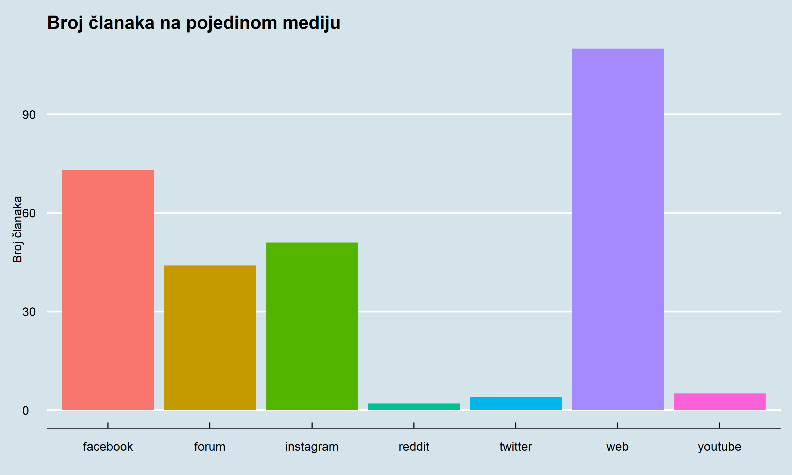
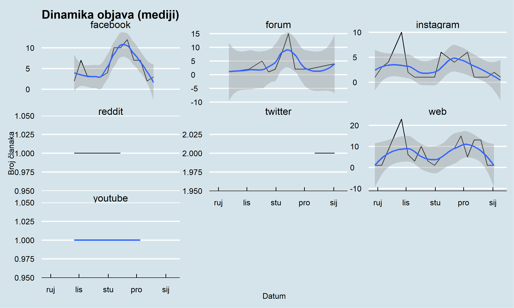
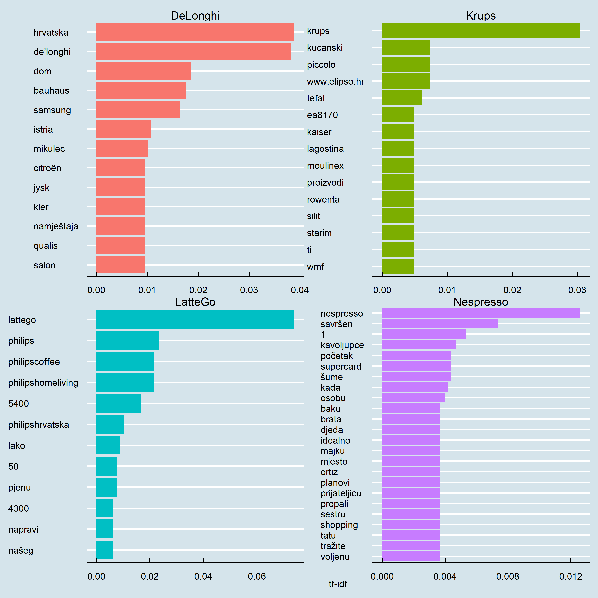
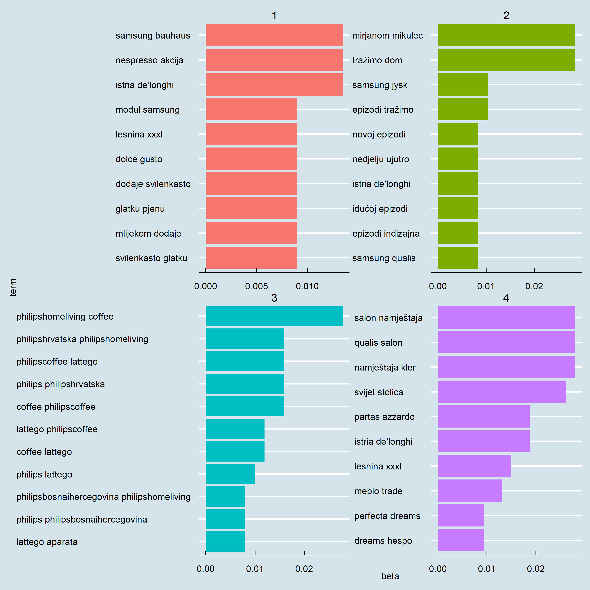

## **Što je unutra?**


- Medijske objave o aparatima za kavu u Hrvatskoj (*LatteGo*, *De`Longhi*, *Krups* i *Nesspreso*)
<br><br>
- Cijeli medijski prostor u Hrvatskoj 
<br><br>
- Razdoblje od 2021-01-09 do 2022-11-01
<br><br>
- Podatci sa [mediatoolkit](https://www.mediatoolkit.com/) servisa
<br><br>
- 290 objava koje sadrže ukupno 8.980 riječi
<br><br>
- Izvještaj uključuje: *pregled medijskog prostora*, *analizu sentimenta*, *analizu sadržaja* i *tematsku analizu*


## **Medijski prostor:**


<br>

- Najvažniji mediji su Web, facebook, instagram i forum
<br><br>
- Nespresso dominira u medijskom prostoru, a DeLonghi slijedi
<br><br>
- Krups i LatteGo zaostaju i na sličnim pozicijama
<br><br>
- Medijske kampanje u dvomjesečnim ciklusima
<br><br>
- Facebook, forum, Instagram imaju jednaku dinamiku
<br><br>
- Brandovi se međusobno prate u medijskom prostoru

<br>
<button class="btn btn-primary" data-toggle="collapse" data-target="#Block6"> Pregled medijskog prostora </button>  
<div id="Block6" class="collapse">

<!-- -->

```
## List of 41
##  $ line                :List of 6
##   ..$ colour       : chr "black"
##   ..$ size         : NULL
##   ..$ linetype     : NULL
##   ..$ lineend      : NULL
##   ..$ arrow        : logi FALSE
##   ..$ inherit.blank: logi TRUE
##   ..- attr(*, "class")= chr [1:2] "element_line" "element"
##  $ rect                :List of 5
##   ..$ fill         : Named chr NA
##   .. ..- attr(*, "names")= chr NA
##   ..$ colour       : logi NA
##   ..$ size         : NULL
##   ..$ linetype     : num 1
##   ..$ inherit.blank: logi TRUE
##   ..- attr(*, "class")= chr [1:2] "element_rect" "element"
##  $ text                :List of 11
##   ..$ family       : NULL
##   ..$ face         : NULL
##   ..$ colour       : chr "black"
##   ..$ size         : NULL
##   ..$ hjust        : NULL
##   ..$ vjust        : NULL
##   ..$ angle        : NULL
##   ..$ lineheight   : NULL
##   ..$ margin       : NULL
##   ..$ debug        : NULL
##   ..$ inherit.blank: logi TRUE
##   ..- attr(*, "class")= chr [1:2] "element_text" "element"
##  $ axis.title          :List of 11
##   ..$ family       : NULL
##   ..$ face         : NULL
##   ..$ colour       : NULL
##   ..$ size         : 'rel' num 1
##   ..$ hjust        : NULL
##   ..$ vjust        : NULL
##   ..$ angle        : NULL
##   ..$ lineheight   : NULL
##   ..$ margin       : NULL
##   ..$ debug        : NULL
##   ..$ inherit.blank: logi TRUE
##   ..- attr(*, "class")= chr [1:2] "element_text" "element"
##  $ axis.title.x        :List of 11
##   ..$ family       : NULL
##   ..$ face         : NULL
##   ..$ colour       : NULL
##   ..$ size         : NULL
##   ..$ hjust        : NULL
##   ..$ vjust        : NULL
##   ..$ angle        : NULL
##   ..$ lineheight   : NULL
##   ..$ margin       : NULL
##   ..$ debug        : NULL
##   ..$ inherit.blank: logi TRUE
##   ..- attr(*, "class")= chr [1:2] "element_text" "element"
##  $ axis.title.y        :List of 11
##   ..$ family       : NULL
##   ..$ face         : NULL
##   ..$ colour       : NULL
##   ..$ size         : NULL
##   ..$ hjust        : NULL
##   ..$ vjust        : NULL
##   ..$ angle        : num 90
##   ..$ lineheight   : NULL
##   ..$ margin       : NULL
##   ..$ debug        : NULL
##   ..$ inherit.blank: logi TRUE
##   ..- attr(*, "class")= chr [1:2] "element_text" "element"
##  $ axis.text           :List of 11
##   ..$ family       : NULL
##   ..$ face         : NULL
##   ..$ colour       : NULL
##   ..$ size         : 'rel' num 1
##   ..$ hjust        : NULL
##   ..$ vjust        : NULL
##   ..$ angle        : NULL
##   ..$ lineheight   : NULL
##   ..$ margin       : NULL
##   ..$ debug        : NULL
##   ..$ inherit.blank: logi TRUE
##   ..- attr(*, "class")= chr [1:2] "element_text" "element"
##  $ axis.text.x         :List of 11
##   ..$ family       : NULL
##   ..$ face         : NULL
##   ..$ colour       : NULL
##   ..$ size         : NULL
##   ..$ hjust        : NULL
##   ..$ vjust        : num 0
##   ..$ angle        : NULL
##   ..$ lineheight   : NULL
##   ..$ margin       : 'margin' num [1:4] 10points 0points 0points 0points
##   .. ..- attr(*, "unit")= int 8
##   ..$ debug        : NULL
##   ..$ inherit.blank: logi TRUE
##   ..- attr(*, "class")= chr [1:2] "element_text" "element"
##  $ axis.text.x.top     :List of 11
##   ..$ family       : NULL
##   ..$ face         : NULL
##   ..$ colour       : NULL
##   ..$ size         : NULL
##   ..$ hjust        : NULL
##   ..$ vjust        : num 0
##   ..$ angle        : NULL
##   ..$ lineheight   : NULL
##   ..$ margin       : 'margin' num [1:4] 0points 0points 10points 0points
##   .. ..- attr(*, "unit")= int 8
##   ..$ debug        : NULL
##   ..$ inherit.blank: logi TRUE
##   ..- attr(*, "class")= chr [1:2] "element_text" "element"
##  $ axis.text.y         :List of 11
##   ..$ family       : NULL
##   ..$ face         : NULL
##   ..$ colour       : NULL
##   ..$ size         : NULL
##   ..$ hjust        : num 0
##   ..$ vjust        : NULL
##   ..$ angle        : NULL
##   ..$ lineheight   : NULL
##   ..$ margin       : 'margin' num [1:4] 0points 10points 0points 0points
##   .. ..- attr(*, "unit")= int 8
##   ..$ debug        : NULL
##   ..$ inherit.blank: logi TRUE
##   ..- attr(*, "class")= chr [1:2] "element_text" "element"
##  $ axis.ticks          :List of 6
##   ..$ colour       : NULL
##   ..$ size         : NULL
##   ..$ linetype     : NULL
##   ..$ lineend      : NULL
##   ..$ arrow        : logi FALSE
##   ..$ inherit.blank: logi TRUE
##   ..- attr(*, "class")= chr [1:2] "element_line" "element"
##  $ axis.ticks.y        : list()
##   ..- attr(*, "class")= chr [1:2] "element_blank" "element"
##  $ axis.ticks.length   : 'simpleUnit' num -5points
##   ..- attr(*, "unit")= int 8
##  $ axis.line           :List of 6
##   ..$ colour       : NULL
##   ..$ size         : 'rel' num 0.8
##   ..$ linetype     : NULL
##   ..$ lineend      : NULL
##   ..$ arrow        : logi FALSE
##   ..$ inherit.blank: logi TRUE
##   ..- attr(*, "class")= chr [1:2] "element_line" "element"
##  $ axis.line.y         : list()
##   ..- attr(*, "class")= chr [1:2] "element_blank" "element"
##  $ legend.background   :List of 5
##   ..$ fill         : NULL
##   ..$ colour       : NULL
##   ..$ size         : NULL
##   ..$ linetype     : num 0
##   ..$ inherit.blank: logi TRUE
##   ..- attr(*, "class")= chr [1:2] "element_rect" "element"
##  $ legend.spacing      : 'simpleUnit' num 15points
##   ..- attr(*, "unit")= int 8
##  $ legend.key          :List of 5
##   ..$ fill         : NULL
##   ..$ colour       : NULL
##   ..$ size         : NULL
##   ..$ linetype     : num 0
##   ..$ inherit.blank: logi TRUE
##   ..- attr(*, "class")= chr [1:2] "element_rect" "element"
##  $ legend.key.size     : 'simpleUnit' num 1.2lines
##   ..- attr(*, "unit")= int 3
##  $ legend.key.height   : NULL
##  $ legend.key.width    : NULL
##  $ legend.text         :List of 11
##   ..$ family       : NULL
##   ..$ face         : NULL
##   ..$ colour       : NULL
##   ..$ size         : 'rel' num 1.25
##   ..$ hjust        : NULL
##   ..$ vjust        : NULL
##   ..$ angle        : NULL
##   ..$ lineheight   : NULL
##   ..$ margin       : NULL
##   ..$ debug        : NULL
##   ..$ inherit.blank: logi TRUE
##   ..- attr(*, "class")= chr [1:2] "element_text" "element"
##  $ legend.text.align   : NULL
##  $ legend.title        :List of 11
##   ..$ family       : NULL
##   ..$ face         : NULL
##   ..$ colour       : NULL
##   ..$ size         : 'rel' num 1
##   ..$ hjust        : num 0
##   ..$ vjust        : NULL
##   ..$ angle        : NULL
##   ..$ lineheight   : NULL
##   ..$ margin       : NULL
##   ..$ debug        : NULL
##   ..$ inherit.blank: logi TRUE
##   ..- attr(*, "class")= chr [1:2] "element_text" "element"
##  $ legend.title.align  : NULL
##  $ legend.position     : chr "top"
##  $ legend.direction    : NULL
##  $ legend.justification: chr "center"
##  $ panel.background    :List of 5
##   ..$ fill         : NULL
##   ..$ colour       : NULL
##   ..$ size         : NULL
##   ..$ linetype     : num 0
##   ..$ inherit.blank: logi TRUE
##   ..- attr(*, "class")= chr [1:2] "element_rect" "element"
##  $ panel.border        : list()
##   ..- attr(*, "class")= chr [1:2] "element_blank" "element"
##  $ panel.spacing       : 'simpleUnit' num 0.25lines
##   ..- attr(*, "unit")= int 3
##  $ panel.grid.major    :List of 6
##   ..$ colour       : chr "white"
##   ..$ size         : 'rel' num 1.75
##   ..$ linetype     : NULL
##   ..$ lineend      : NULL
##   ..$ arrow        : logi FALSE
##   ..$ inherit.blank: logi TRUE
##   ..- attr(*, "class")= chr [1:2] "element_line" "element"
##  $ panel.grid.minor    : list()
##   ..- attr(*, "class")= chr [1:2] "element_blank" "element"
##  $ plot.background     :List of 5
##   ..$ fill         : Named chr "#d5e4eb"
##   .. ..- attr(*, "names")= chr "blue-gray"
##   ..$ colour       : logi NA
##   ..$ size         : NULL
##   ..$ linetype     : NULL
##   ..$ inherit.blank: logi TRUE
##   ..- attr(*, "class")= chr [1:2] "element_rect" "element"
##  $ plot.title          :List of 11
##   ..$ family       : NULL
##   ..$ face         : chr "bold"
##   ..$ colour       : NULL
##   ..$ size         : 'rel' num 1.5
##   ..$ hjust        : num 0
##   ..$ vjust        : NULL
##   ..$ angle        : NULL
##   ..$ lineheight   : NULL
##   ..$ margin       : NULL
##   ..$ debug        : NULL
##   ..$ inherit.blank: logi TRUE
##   ..- attr(*, "class")= chr [1:2] "element_text" "element"
##  $ plot.margin         : 'simpleUnit' num [1:4] 12points 10points 12points 10points
##   ..- attr(*, "unit")= int 8
##  $ strip.background    :List of 5
##   ..$ fill         : Named chr NA
##   .. ..- attr(*, "names")= chr NA
##   ..$ colour       : logi NA
##   ..$ size         : NULL
##   ..$ linetype     : num 0
##   ..$ inherit.blank: logi TRUE
##   ..- attr(*, "class")= chr [1:2] "element_rect" "element"
##  $ strip.text          :List of 11
##   ..$ family       : NULL
##   ..$ face         : NULL
##   ..$ colour       : NULL
##   ..$ size         : 'rel' num 1.25
##   ..$ hjust        : NULL
##   ..$ vjust        : NULL
##   ..$ angle        : NULL
##   ..$ lineheight   : NULL
##   ..$ margin       : NULL
##   ..$ debug        : NULL
##   ..$ inherit.blank: logi TRUE
##   ..- attr(*, "class")= chr [1:2] "element_text" "element"
##  $ strip.text.x        :List of 11
##   ..$ family       : NULL
##   ..$ face         : NULL
##   ..$ colour       : NULL
##   ..$ size         : NULL
##   ..$ hjust        : NULL
##   ..$ vjust        : NULL
##   ..$ angle        : NULL
##   ..$ lineheight   : NULL
##   ..$ margin       : NULL
##   ..$ debug        : NULL
##   ..$ inherit.blank: logi TRUE
##   ..- attr(*, "class")= chr [1:2] "element_text" "element"
##  $ strip.text.y        :List of 11
##   ..$ family       : NULL
##   ..$ face         : NULL
##   ..$ colour       : NULL
##   ..$ size         : NULL
##   ..$ hjust        : NULL
##   ..$ vjust        : NULL
##   ..$ angle        : num -90
##   ..$ lineheight   : NULL
##   ..$ margin       : NULL
##   ..$ debug        : NULL
##   ..$ inherit.blank: logi TRUE
##   ..- attr(*, "class")= chr [1:2] "element_text" "element"
##  $ panel.grid.major.x  : list()
##   ..- attr(*, "class")= chr [1:2] "element_blank" "element"
##  - attr(*, "class")= chr [1:2] "theme" "gg"
##  - attr(*, "complete")= logi TRUE
##  - attr(*, "validate")= logi TRUE
```

<!-- --><!-- --><!-- -->

</div>
<br>

- Najčešće riječi su nazivi brandova (Nespresso,DeLonghi i LatteGo)
<br><br>
- Često se spominju i riječi *dom, namještaj, akcije i veliki saloni namještaja*
<br><br>
- Ovo ukazuje na *važnost "mitologije doma"* (manja važnost "mitologije okusa" i/ili "mitologije stila")
<br><br>
- Od prosinca zaoštrena konkurencija između Nespresso, LatteGo i Krups


<br>

<button class="btn btn-primary" data-toggle="collapse" data-target="#Block7"> Najčešće riječi u tekstu </button>  
<div id="Block7" class="collapse">

<!-- --><!-- -->

</div>
<br>

- Općenito **pozitivan sentiment** medijskih objava
<br><br>
- Pozitivan sentiment na osnovi tematike vezane uz **dom, obitelj i kvalitetu života**
<br><br>


<button class="btn btn-primary" data-toggle="collapse" data-target="#Block8"> Najčešće riječi u tekstu </button>  
<div id="Block8" class="collapse">

<!-- -->

</div>
<br>


## **Analiza sentimenta**


- Pozitivan sentiment u periodu pred i za vrijeme blagdana
<br><br>
- Razdoblje za plasman proizvoda na tržište kada je dom u fokusu

<br>
<button class="btn btn-primary" data-toggle="collapse" data-target="#Block9"> Kretanje sentimenta kroz vrijeme </button>  
<div id="Block9" class="collapse">

<!-- -->

</div>
<br>


- Riječi koje najviše doprinose pozitivnom sentimentu vezane uz **dom**, zdravlje i kvalitetu života
<br><br>
- Važnost nagradnih igara i darivanja


<br>
<button class="btn btn-primary" data-toggle="collapse" data-target="#Block10"> Doprinos sentimentu </button>  
<div id="Block10" class="collapse">

<!-- -->

</div>
<br>


- Najbolje plasirane medijske objave ima DeLongi (indeks pozitivbnosti)
<br><br>
- Dobra medijska strategija;znatno bolje pozicija od tržišnog lidera Nespresso
<br><br>
- Tržišni lider Nespresso, LatteGo i Krups slični


<br>
<button class="btn btn-primary" data-toggle="collapse" data-target="#Block12"> Indeks pozitivnosti brandova </button>  
<div id="Block12" class="collapse">

<table class=" lightable-classic-2" style='font-family: "Arial Narrow", "Source Sans Pro", sans-serif; margin-left: auto; margin-right: auto;'>
 <thead>
  <tr>
   <th style="text-align:left;"> kword </th>
   <th style="text-align:right;"> pozWords </th>
   <th style="text-align:right;"> word </th>
   <th style="text-align:right;"> pozitivnostIndex </th>
  </tr>
 </thead>
<tbody>
  <tr>
   <td style="text-align:left;"> DeLonghi </td>
   <td style="text-align:right;"> 41 </td>
   <td style="text-align:right;"> 1196 </td>
   <td style="text-align:right;"> 3.428094 </td>
  </tr>
  <tr>
   <td style="text-align:left;"> Nespresso </td>
   <td style="text-align:right;"> 20 </td>
   <td style="text-align:right;"> 1083 </td>
   <td style="text-align:right;"> 1.846722 </td>
  </tr>
  <tr>
   <td style="text-align:left;"> LatteGo </td>
   <td style="text-align:right;"> 10 </td>
   <td style="text-align:right;"> 546 </td>
   <td style="text-align:right;"> 1.831502 </td>
  </tr>
  <tr>
   <td style="text-align:left;"> Krups </td>
   <td style="text-align:right;"> 4 </td>
   <td style="text-align:right;"> 233 </td>
   <td style="text-align:right;"> 1.716738 </td>
  </tr>
</tbody>
</table>

</div>
<br>


## Najvazniji pojmovi

-  **Najbitnije** riječi

- To se radi pomoću [IDF (inverse document frequency)](https://citeseerx.ist.psu.edu/viewdoc/download?doi=10.1.1.438.2284&rep=rep1&type=pdf) metode 

- IDF metoda omogućuje identifikaciju važnih (ne nužno čestih) riječi u korpusu i može poslužiti za analizu najvažnijih pojmova po brandovima


<br>
<button class="btn btn-primary" data-toggle="collapse" data-target="#Block13"> Pregled najvažnijih riječi za svaki brand </button>  
<div id="Block13" class="collapse">

<!-- -->

</div>
<br>


### nGrami


<br>
<button class="btn btn-primary" data-toggle="collapse" data-target="#Block14"> Pregled najvažnijih bigrama </button>  
<div id="Block14" class="collapse">


```
##                      bigram  n
## 1                   za kavu 64
## 2        de’longhi hrvatska 44
## 3                 aparat za 36
## 4          bauhaus hrvatska 33
## 5              nespresso je 24
## 6                      je u 22
## 7          istria de’longhi 20
## 8                 my istria 20
## 9             jysk hrvatska 18
## 10            kler hrvatska 18
## 11          namještaja kler 18
## 12             qualis salon 18
## 13         salon namještaja 18
## 14                    dom s 16
## 15       hrvatska family.hr 16
## 16         mirjanom mikulec 16
## 17               s mirjanom 16
## 18              tražimo dom 16
## 19                   dom po 15
## 20                  moj dom 15
## 21                   za sve 15
## 22      family.hr de’longhi 14
## 23          hrvatska svijet 14
## 24             lesnina xxxl 14
## 25 philipshomeliving coffee 14
```

<!-- -->

</div>
<br>


Povezane riječi:


<br>
<button class="btn btn-primary" data-toggle="collapse" data-target="#Block15"> Pregled korelacije između branda i riječi </button>  
<div id="Block15" class="collapse">

<!-- -->

</div>
<br>

## Tematska analiza

- Glavne teme u su: 


<br>
<button class="btn btn-primary" data-toggle="collapse" data-target="#Block16"> Tematska analiza </button>  
<div id="Block16" class="collapse">

<!-- -->

</div>
<br>

- 


<br>
<button class="btn btn-primary" data-toggle="collapse" data-target="#Block17"> Tematska (4) analiza -  bigrami </button>  
<div id="Block17" class="collapse">

<!-- -->

</div>
<br>


## Zaključak


