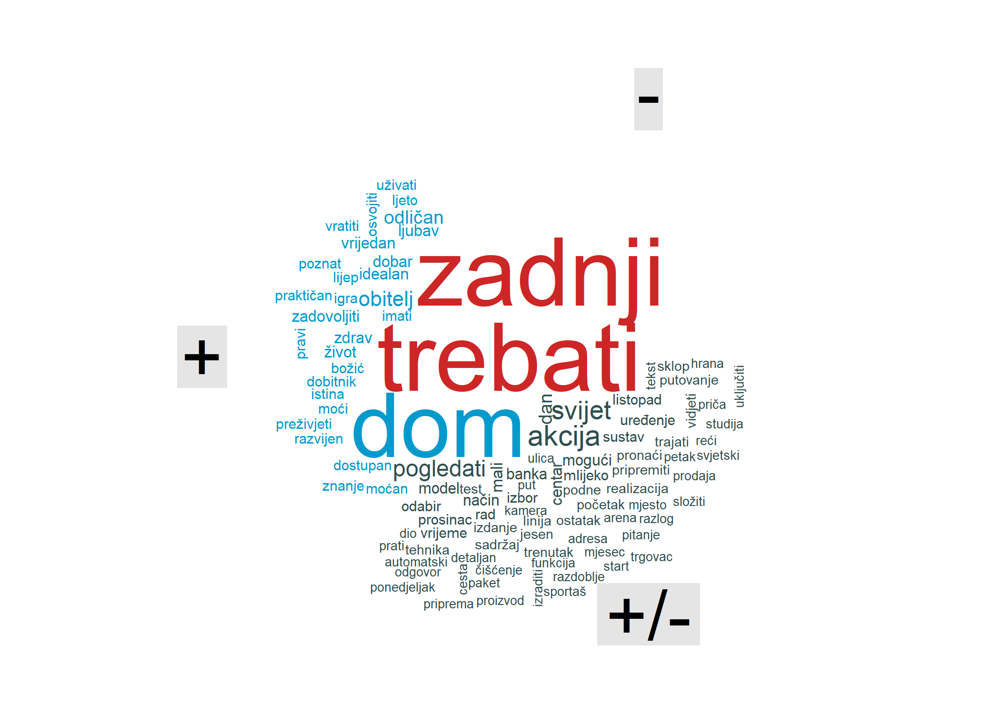
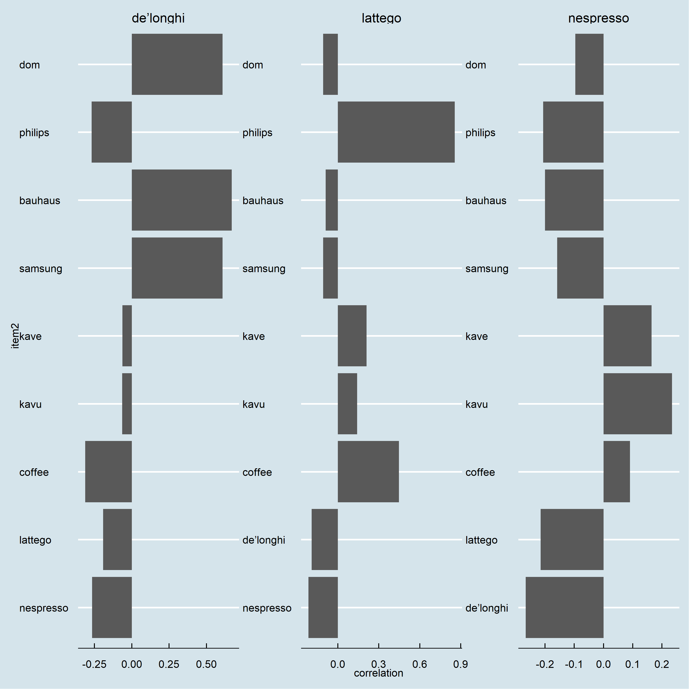

## **Opće**
***
 

- Medijske objave o aparatima za kavu u Hrvatskoj (*LatteGo*, *De`Longhi*, *Krups* i *Nesspreso*)
  
- Cijeli medijski prostor u Hrvatskoj 
  
- Razdoblje od 2021-01-09 do 2022-11-01
  
- Podatci sa [mediatoolkit](https://www.mediatoolkit.com/) servisa
  
- 290 objava koje sadrže ukupno 8.980 riječi
  
- Izvještaj uključuje: *pregled medijskog prostora*, *analizu sentimenta*, *analizu sadržaja* i *tematsku analizu*

## **Medijski prostor**
***
 

- Najvažniji mediji su Web, Facebook, Instagram i forum
  
- Nespresso dominira u medijskom prostoru, a DeLonghi slijedi
  
- Krups i LatteGo zaostaju i na sličnim pozicijama
  
- Medijske kampanje u dvomjesečnim ciklusima
  
- Facebook, forum, Instagram imaju jednaku dinamiku
  
- Brandovi se međusobno prate u medijskom prostoru

 
<button class="btn btn-primary" data-toggle="collapse" data-target="#Block6"> Pregled medijskog prostora </button>  

<!-- --><!-- --><!-- --><!-- -->

 

- Najčešće riječi su nazivi brandova (Nespresso,DeLonghi i LatteGo)
  
- Često se spominju i riječi *dom, namještaj, akcije i veliki saloni namještaja*
  
- Ovo ukazuje na *važnost "mitologije doma"* (manja važnost "mitologije okusa" i/ili "mitologije stila")
  
- Od prosinca zaoštrena konkurencija između Nespresso, LatteGo i Krups

 

<button class="btn btn-primary" data-toggle="collapse" data-target="#Block7"> Najčešće riječi u tekstu </button>  

<!-- --><!-- -->

 

- Općenito **pozitivan sentiment** medijskih objava
  
- Pozitivan sentiment na osnovi tematike vezane uz **dom, obitelj i kvalitetu života**
  

<button class="btn btn-primary" data-toggle="collapse" data-target="#Block8"> Najčešće riječi u tekstu </button>  

<!-- -->

 

## **Analiza sentimenta**
***
 

- Pozitivan sentiment u periodu pred i za vrijeme blagdana
  
- Razdoblje za plasman proizvoda na tržište kada je dom u fokusu

 
<button class="btn btn-primary" data-toggle="collapse" data-target="#Block9"> Kretanje sentimenta kroz vrijeme </button>  

<!-- -->

 

- Riječi koje najviše doprinose pozitivnom sentimentu vezane uz **dom**, zdravlje i kvalitetu života
  
- Važnost nagradnih igara i darivanja

 
<button class="btn btn-primary" data-toggle="collapse" data-target="#Block10"> Doprinos sentimentu </button>  

<!-- -->

 

- Najbolje plasirane medijske objave ima DeLongi (najveći indeks pozitivnosti)
  
- Dobra medijska strategija;znatno bolja pozicija od tržišnog lidera Nespresso
  
- Tržišni lider Nespresso, LatteGo i Krups slični

 
<button class="btn btn-primary" data-toggle="collapse" data-target="#Block12"> Indeks pozitivnosti brandova </button>  

<table class=" lightable-classic-2" style='font-family: "Arial Narrow", "Source Sans Pro", sans-serif; margin-left: auto; margin-right: auto;'>
 <thead>
  <tr>
   <th style="text-align:left;"> kword </th>
   <th style="text-align:right;"> pozWords </th>
   <th style="text-align:right;"> word </th>
   <th style="text-align:right;"> pozitivnostIndex </th>
  </tr>
 </thead>
<tbody>
  <tr>
   <td style="text-align:left;"> DeLonghi </td>
   <td style="text-align:right;"> 41 </td>
   <td style="text-align:right;"> 1196 </td>
   <td style="text-align:right;"> 3.428094 </td>
  </tr>
  <tr>
   <td style="text-align:left;"> Nespresso </td>
   <td style="text-align:right;"> 20 </td>
   <td style="text-align:right;"> 1083 </td>
   <td style="text-align:right;"> 1.846722 </td>
  </tr>
  <tr>
   <td style="text-align:left;"> LatteGo </td>
   <td style="text-align:right;"> 10 </td>
   <td style="text-align:right;"> 546 </td>
   <td style="text-align:right;"> 1.831502 </td>
  </tr>
  <tr>
   <td style="text-align:left;"> Krups </td>
   <td style="text-align:right;"> 4 </td>
   <td style="text-align:right;"> 233 </td>
   <td style="text-align:right;"> 1.716738 </td>
  </tr>
</tbody>
</table>

 

## **Najvažniji pojmovi**
***
 

- Najbitnije riječi izračunate pomoću [IDF (inverse document frequency)](https://citeseerx.ist.psu.edu/viewdoc/download?doi=10.1.1.438.2284&rep=rep1&type=pdf) metode 
  
- Vidljiv **fokus DeLonghija na dom**, salone namještaja i općenito tematiku doma (saloni namještaja)
  
- **Krups pozicioniran u domenu bijele tehnike** (saloni bijele tehnike)
  
- **LatteGo jako ističe okus, kvalitetu i tehnologiju** (prepoznatljivost u okviru branda Phillips)
  
- **Nespresso gradi brand na okusu i stilu življenja** (socijalizacija i kultura pijenja kave)

 
<button class="btn btn-primary" data-toggle="collapse" data-target="#Block13"> Pregled najvažnijih riječi za brand </button>  

<!-- -->

 

- Jednaki zaključci na osnovi fraza (bigrami)

 
<button class="btn btn-primary" data-toggle="collapse" data-target="#Block14"> Pregled najvažnijih bigrama </button>  

<!-- -->

 

- Korelacija između DeLonghi i pojmova dom i Bauhaus
  
- LatteGo jako vezan uz brand Phillips
  
- Nespresso fokusiran na kavu (kvaliteta, priprema, stil)

 
<button class="btn btn-primary" data-toggle="collapse" data-target="#Block15"> Pregled korelacije između branda i riječi </button>  

<!-- -->

 

## **Tematska analiza**
***
- Identificirane **četiri teme**
  
- Jedna tema se odnosi na uređaje, karakteristike i brandove (tehnički aspekt)
  
- Druga tema je dom, opremanje doma i udobnost življenja
  
- Treća tema je okus i užitak pijenja kave
  
- Četvta tema tema su ponude, akcije, konkurencija

 
<button class="btn btn-primary" data-toggle="collapse" data-target="#Block16"> Tematska analiza </button>  

<!-- -->

 

- Slični rezultati i na tematskoj analizi fraza
  
- Phillips se izdvaja kao zasebna tema

 
<button class="btn btn-primary" data-toggle="collapse" data-target="#Block17"> Tematska analiza -  fraze </button>  

<!-- -->

 

## **Zaključak**
***
 

- Web najbitniji medij

  

- Dijeljenje originalnog web sadržaja na mrežama

  

- Nespresso tržišni lider ali DeLonghi bolje pozicioniran u objavma
  

>  *Mitologija doma* bolje prolazi kod domaće publike (DeLonghi)

> *Mitologija okusa i stila* manje populrna kod domaće publike (Nespresso)

  

 - Važne teme: tehnički aspekti, opremanje doma, užitak konzumacije i okus, akcije i ponuda

